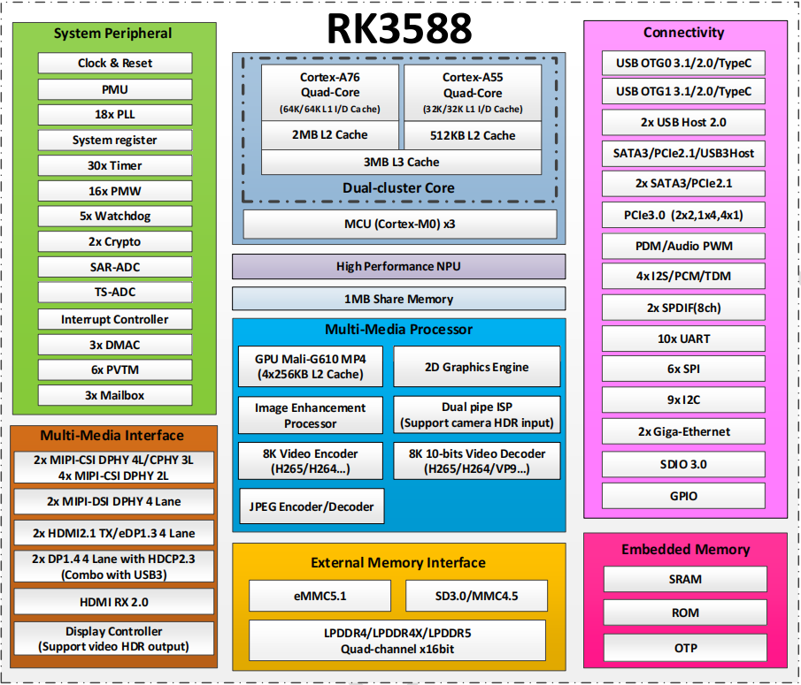
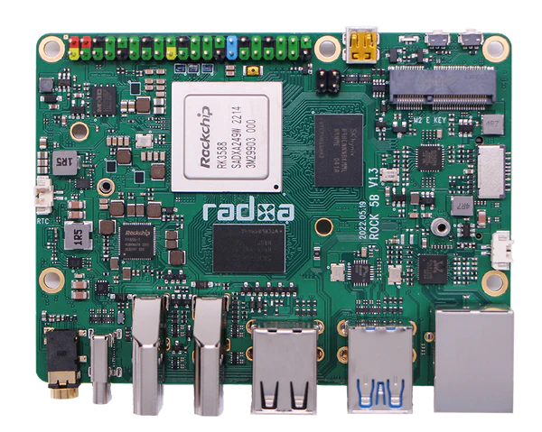
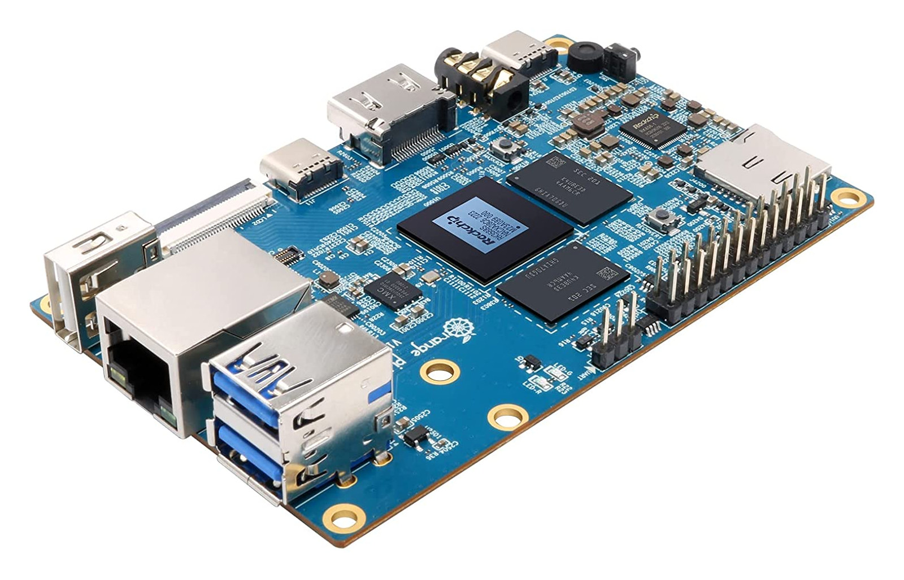

# Introduction
This repository contains the text preparation for the module **Internet & Multimedia** as well as the codes and media files necessary to carry out the laboratories.
The main aim of these laboratories is the understanding of Internet Protocols used to carry the multimedia content. In some cases this kind of operation is called "streaming".
The essential Internet Protocols such as : IP, TC, and UDP do not provide any information about the timing. That is why to correctly send/receive the multimedia content we need an additional protocol called **RTP, Real Time Protocol**. RTP carries time markers and the sequence numbers related to the data packets (media frames).

# Hardware
We are going to work with the last generation of **ARM** based SBC boards built around **RK3588 SoC**. RK3588 is a low power, high performance processor for ARM-based PC and Edge Computing device, personal mobile internet device and other digital multimedia applications, and integrates quad-core Cortex-A76 and quad-core Cortex-A55 with separately NEON coprocessor.
<picture>
 
</picture>

Many embedded powerful hardware engines provide optimized performance for high-end application. RK3588 supports H.265 and VP9 decoder by 8K@60fps, H.264 decoder by
8K@30fps, and AV1 decoder by 4K@60fps, also support H.264 and H.265 encoder by 8K@30fps, high-quality JPEG encoder/decoder, specialized image preprocessor and
postprocessor.

Embedded 3D GPU makes RK3588 completely compatible with OpenGLES 1.1, 2.0, and 3.2, OpenCL up to 2.2 and Vulkan1.2. Special 2D hardware engine with MMU will maximize
display performance and provide very smoothly operation. 

RK3588 introduces a new generation totally hardware-based maximum 48-Megapixel ISP (image signal processor). 

It implements a lot of algorithm accelerators, such as HDR, 3A, LSC, 3DNR, 2DNR, sharpening, dehaze, fisheye correction, gamma correction and so on.
The **build-in NPU** supports INT4/INT8/INT16/FP16 hybrid operation and computing power is up to **6 TOPs**. 

In addition, with its strong compatibility, network models based on a series of frameworks such as **TensorFlow/MXNet/PyTorch/Caffe** can be easily converted into the internal models.

We provide our students with several kinds of RK3588 based boards including, **Radxa Rock Pi 5 (B and A)**, **Orange Pi 5**, etc.

<picture>
 
</picture>
<picture>
 
</picture>

# Laboratories
Our laboratories (**Lab0**) start with the exercises exploiting **UDP** and **TCP** protocols used to send/receive text messages and files; including multimedia files.
This laboratory is completed by the Computer Network lectures provided by David Wetherhall from University of Washington. The visioning of these lectures is highly recomemded  to our students.

The second laboratory **Lab1** introduces the basic functions Gstreamer allowing us to capture the audio/video content and to reproduce it on the speaker/display devices.

**Lab2** and **Lab3** are dedicated to the streaming with **UDP/RTP** and **UDP/RTP/RTCP**.

